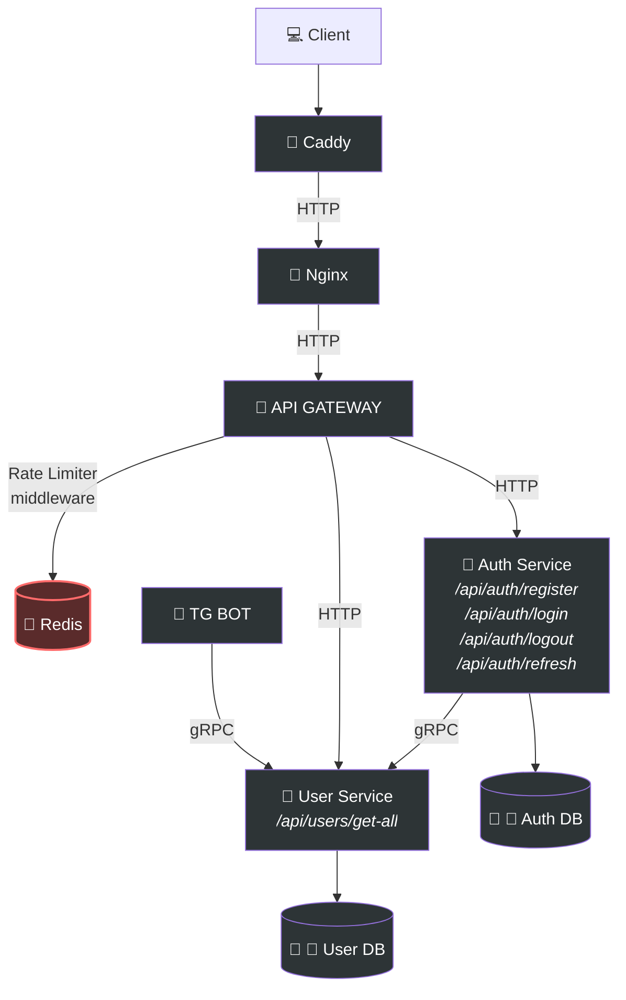

# 🔐 Go JWT Auth

A full-stack JWT authentication system built with microservices architecture.

## 🏗 Architecture



## 🚀 Quick Start

```bash
# Clone and run
git clone https://github.com/yasharusakov/go-jwt-auth.git
cd go-jwt-auth
cp .env.example .env
make docker-run # or docker-compose up --build
```

## 📡 API Endpoints

| Method | Endpoint | Description |
|--------|----------|-------------|
| POST | `/api/auth/register` | Register new user |
| POST | `/api/auth/login` | User login |
| GET | `/api/auth/refresh` | Refresh tokens |
| POST | `/api/auth/logout` | Logout |
| GET | `/api/users` | Get all users |

### Example

```bash
# Register
curl -X POST http://localhost/api/auth/register \
  -H "Content-Type: application/json" \
  -d '{"email": "user@example.com", "password": "password123"}'

# Response
{
  "access_token": "eyJhbG...",
  "user": { "id": "uuid", "email": "user@example.com" }
}
```

## 📁 Project Structure

```
├── backend/
│   ├── api-gateway/      # Entry point & proxy
│   ├── auth-service/     # JWT authentication
│   ├── user-service/     # User management (HTTP + gRPC)
│   └── tg-bot/           # Telegram bot integration
├── frontend/             # React app
├── proto/                # Protobuf definitions
├── .env.example          # Environment variables template
├── .gitignore            # Git ignore rules
├── buf.gen.yaml          # Buf code generation config
├── buf.yaml              # Buf module configuration
├── docker-compose.yaml   # Docker services orchestration
├── Makefile              # Build and run commands
├── nginx.conf.template   # Nginx reverse proxy config
└── README.md             # Project documentation
```

## Tech Stack

**Backend:**
- Go 1.25
- Fiber (HTTP framework)
- gRPC (inter-service communication)
- GORM (PostgreSQL ORM)
- Redis (rate limiting)
- JWT (access + refresh tokens)
- Zerolog (logging)

**Frontend:**
- React
- TypeScript
- Redux Toolkit
- Vite

**Infrastructure:**
- Docker & Docker Compose
- Caddy (reverse proxy / TLS)
- Nginx (reverse proxy)
- Buf (protobuf code generation)

After running `make docker-run`, open in your browser:

- **Frontend:** [http://localhost](http://localhost)
- **API Gateway:** [http://localhost:8080](http://localhost:8080)
- **Health Check:** [http://localhost:8080/health](http://localhost:8080/health)

## 👤 Author


[yasharusakov](https://github.com/yasharusakov)
